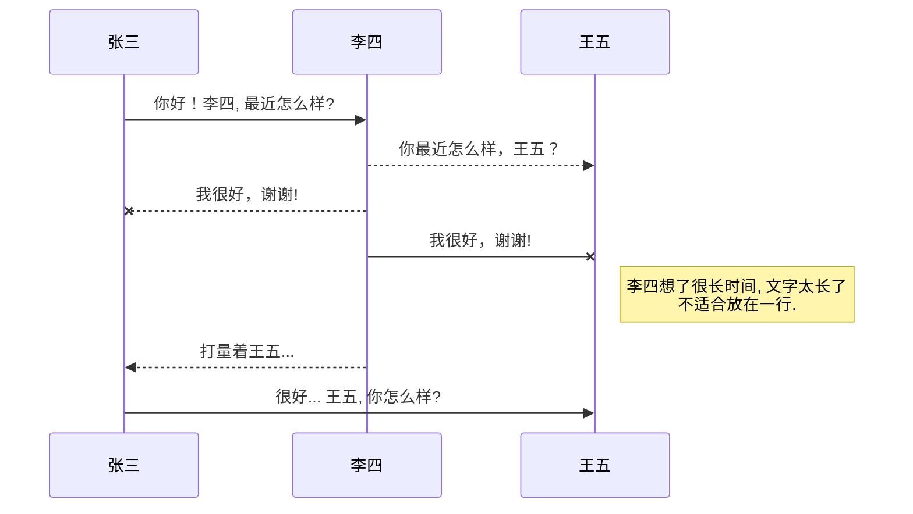

# 这是一个测试页

你可能在这个页面看到很多无意义的内容，不要担心。这是属于我的沙盒，但是可能经常忘记清理里面的内容。

|1|2|3|
|:--:|:--:|:--:|
|4|5|6|

试一下注解[^1]和竹节

[^1]:一个注释

*[竹节]:你问我我问谁

```mermaid
sequenceDiagram
张三 ->> 李四: 你好！李四, 最近怎么样?
李四-->>王五: 你最近怎么样，王五？
李四--x 张三: 我很好，谢谢!
李四-x 王五: 我很好，谢谢!
Note right of 王五: 李四想了很长时间, 文字太长了<br/>不适合放在一行.

李四-->>张三: 打量着王五...
张三->>王五: 很好... 王五, 你怎么样?
```